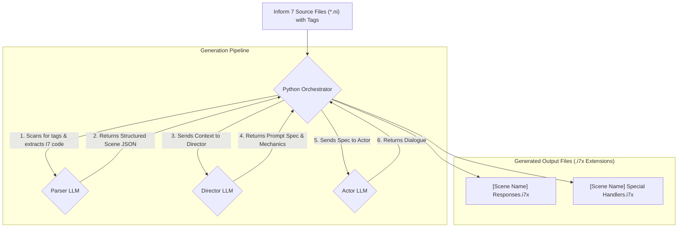

# Project Plan: "Unwinnable By Design" Content Generation Engine (v5.0 FINAL)

**Objective:** To create a sophisticated, automated pipeline that uses the handwritten Inform 7 source code as the single source of truth to generate comprehensive response tables and special game mechanics.

---

## Core Philosophy: Literate Programming & Single Source of Truth

The engine is designed around a core principle: the human-written Inform 7 code is the ultimate authority. The AI pipeline serves to augment this code, not to generate it from a separate specification. All game definitions, rooms, and objects are written once, directly in `.ni` source files. The engine reads this source to gain context and writes back new, modular `.i7x` extensions containing AI-generated content.

---

## System Architecture: The Tag-Based Extraction Pipeline

The system uses a chain of three specialized LLMs, orchestrated by a Python script, which scans the Inform 7 source files for explicit tags.

### Tier 1: The Parser LLM (Structural Analyst)
*   **Input:** A block of Inform 7 code extracted from between `[-- ... --]` tags in a `.ni` source file.
*   **Output:** A detailed JSON object cataloging the scene's room, all entities (objects, NPCs, scenery) with their full descriptions and properties, and any associated rules.

### Tier 2: The Director LLM (Strategic Game Designer)
*   **Input:** A player action permutation and the rich contextual JSON from the Parser.
*   **Context Files:** `design/tactics.md`, `design/emotions.md`.
*   **Responsibilities:**
    1.  **Grammatical Filtering:** Rejects unparseable I7 commands.
    2.  **Tactical Selection:** Chooses a tactic and emotion based on context and intensity.
    3.  **Outcome Decision:** Decides between `refusal`, `malicious-compliance`, or `special-handling`.
    4.  **Code Generation:** If the outcome is `special-handling`, generates the mechanical Inform 7 code for the event.
*   **Output:** A JSON "prompt specification" for the Actor, which may include generated code.

### Tier 3: The Actor LLM (Creative Performer)
*   **Input:** The prompt specification from the Director.
*   **Context File:** `design/actor.md` (The GRIM Bible).
*   **Task:** To generate the final, in-character dialogue for Grim, embracing any conflicting directions as a feature of the character's fractured personality.
*   **Output:** A block of creative text.

---

## The Authoring and Generation Workflow

### 1. Authoring (Human)
*   **Location:** All handwritten game content is created in `.ni` files within the `Unwinnable-By-Design.inform/Source/` directory. The project can be organized with one file per scene (e.g., `Get the Quest.ni`).
*   **Tagging:** To make content visible to the engine, it is wrapped in a simple comment tag at the top of the file: `[-- SCENE 'Get the Quest' --]`. The engine will process the entire contents of any file that begins with such a tag.

### 2. Generation (Machine)
*   **Execution:** The developer runs the Python orchestrator script (e.g., `python generate_responses.py`).
*   **Scanning:** The script scans all `.ni` files in the `Source` directory for the scene tag and any `DIRECTOR_NOTE` tags within the file.
*   **Pipeline:** For each tagged file, it executes the Parser -> Director -> Actor pipeline for all possible action permutations. The extracted `DIRECTOR_NOTE` is passed to the Director LLM to provide specific instructions that override its default behavior.
*   **Output:** The script generates two types of modular extension files in a separate output directory:
    *   `[Scene Name] Responses.i7x`: A table of all generated dialogue.
    *   `[Scene Name] Special Handlers.i7x`: Contains any custom Inform 7 code generated by the Director for `special-handling` events.

### 3. Integration (Human)
*   The developer places the generated `.i7x` files into the `Unwinnable-By-Design.inform/Extensions/` directory.
*   The main `story.ni` file is kept clean, containing the `Use [Scene Name] Responses.` and `Use [Scene Name] Special Handlers.` directives to include the machine-generated content.

### 4. Human-in-the-Loop (HITL)
*   The generated `Responses` table includes an `approved` column, allowing a human to review and lock in good responses. The script will not overwrite rows where `approved` is set to `true`.
