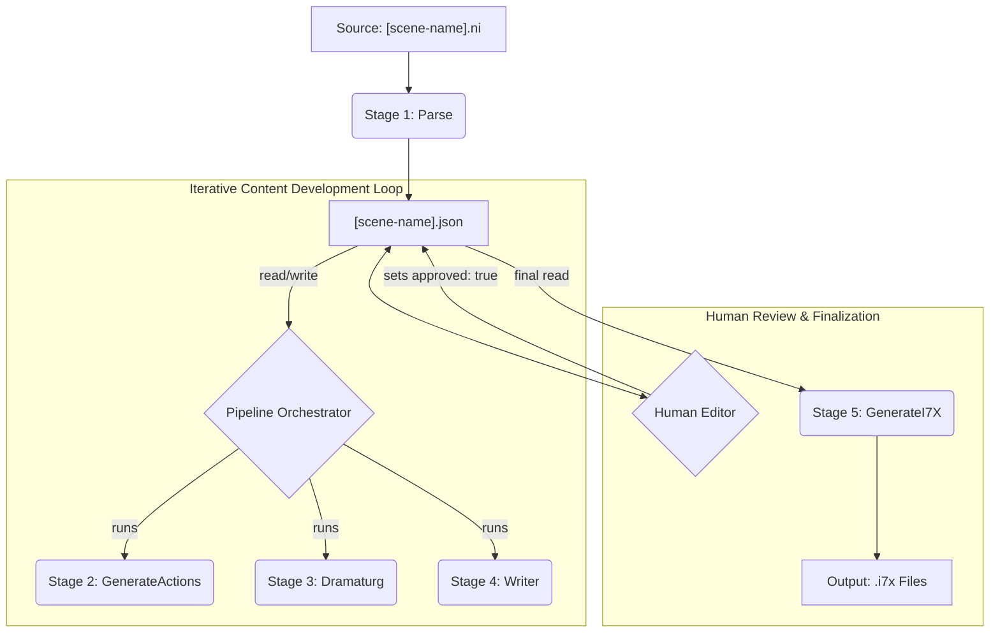

# Unwinnable by Design: Content Pipeline Architecture (v2.0)

## 1. Core Philosophy

This document outlines the architecture for the content development pipeline for "Unwinnable by Design." The system is built on two core principles:

1.  **Literate Programming as the Foundation**: The handwritten Inform 7 source code (`.ni` files) remains the ultimate source of truth for all scene definitions, including rooms, objects, and characters. The pipeline reads this human-authored code to bootstrap its process.
2.  **Human-in-the-Loop as a Core Feature**: The pipeline is not a fully automated, "fire-and-forget" system. It is an iterative content development tool designed to augment human creativity. A human editor has granular control over every piece of generated content and can approve, reject, or rewrite content at any stage.

## 2. High-Level Architecture

The system is designed as a modular, multi-stage pipeline that operates on a central JSON data file for each scene. Each stage is a discrete Python class that performs a specific transformation on the scene's data.



## 3. The Central Data Store: `[scene-name].json`

The heart of the pipeline is a JSON file for each scene (e.g., `Get-the-Quest.json`). This file serves as the single, canonical data store for all generated content related to that scene. The pipeline stages iteratively read from and write to this file, progressively enriching it with more detail.

### Hierarchical Approval System

To facilitate the human-in-the-loop workflow, the JSON schema includes a special `approved` key.

-   **Rule**: If any object or dictionary within the JSON contains the key-value pair `"approved": true`, that object and its entire hierarchy of children are considered "locked."
-   **Behavior**: Pipeline stages MUST check for this flag before attempting any modification. If an element is approved, the stage MUST skip it, leaving it and its contents untouched.
-   **Workflow**: This allows a human editor to approve content at any level of granularity. Approving an entire `action` locks its outcome and all its dialogue. Approving a single `dialogue` line locks just that text, allowing the rest of the beat to be re-generated. To trigger a rewrite, the editor simply sets `approved` to `false` or deletes the key.

## 4. The Pipeline Stages

The pipeline is orchestrated by a main Python script that executes each stage in a defined order.

### Stage 1: Parse
-   **Input**: A handwritten Inform 7 source file (e.g., `Get the Quest.ni`).
-   **Role**: To bootstrap the process by converting the Inform 7 definitions into a structured JSON format.
-   **Process**: A "Parser" LLM reads the `.ni` file and extracts the room, entities (people, things, scenery), and their properties.
-   **Output**: The initial `[scene-name].json` file with the foundational scene data.

### Stage 2: Generate Actions
-   **Input**: The `[scene-name].json` file containing the list of entities.
-   **Role**: To create a comprehensive list of all possible, grammatically valid actions for the scene.
-   **Process**: This stage reads a master list of verbs and their arities (from `configs/verbs.json`). It then generates all possible permutations of `performer-verb-noun1-noun2` using the entities present in the scene.
-   **Output**: The `[scene-name].json` file, updated with a list of `actions`, each ready for the next stage.

### Stage 3: Dramaturg
-   **Input**: The `[scene-name].json` file with the list of actions and the scene's narrative structure.
-   **Role**: To serve as the creative director for the scene, understanding dramatic structure, comedic timing, and game mechanics. This is the core of the comedic engine.
-   **Process**: For each un-approved action, the "Dramaturg" LLM performs several key tasks guided by its own instruction set (`dramaturg.md`):
    1.  **Contextual Analysis**: It interprets the player's action in the context of the scene's defined `text` (stated goal), `obstacle` (the conflict), and `subtext` (the hidden, true goal).
    2.  **Scores Creativity**: It analyzes the action and assigns a `creativity` score based on how well the player engages with the subtext.
    3.  **Determines Outcome**: Based on the creativity score, it decides the `outcome` (`refusal`, `malicious-compliance`, or `special-handling`).
    4.  **Designs Comedic Beat & Assigns Points**: It designs the `beat`, a structured array (usually 3-4 steps) that escalates the emotional response. Crucially, it assigns points according to specific rules: negative points are awarded *only* on the third step (the punchline), while boring actions receive 0 or even small positive scores. The point values are calibrated to contribute meaningfully to the scene's `completion_score`.
-   **Output**: The `[scene-name].json` file, with each action now enriched with `dramaturg_notes` and a structured `beat` containing point values.

### Stage 4: Writer
-   **Input**: The `[scene-name].json` file, now containing structured beats.
-   **Role**: To generate the final, in-character dialogue for Grim.
-   **Process**: For each step in an un-approved `beat`, the "Writer" LLM (formerly Actor) is given the full scene context, the specific tactic, emotion, and intensity for that step. It generates only the creative dialogue. Strict post-processing will remove any `*parenthetical stage directions*`.
-   **Output**: The `[scene-name].json` file, with the `dialogue` fields for each beat step now filled in.

### Stage 5: Generate I7X
-   **Input**: The final, human-approved `[scene-name].json` file.
-   **Role**: To compile the structured JSON data into Inform 7 compatible files.
-   **Process**: This stage is purely mechanical. It reads the final JSON and generates two `.i7x` extension files:
    1.  `[Scene Name] Responses.i7x`: A response table containing all the generated dialogue.
    2.  `[Scene Name] Handlers.i7x`: Contains any `special-handling` Inform 7 code generated by the Dramaturg.
-   **Output**: The final `.i7x` files, ready to be included in the main Inform 7 project.

## 5. Detailed JSON Schema Example

This is the target schema for a `[scene-name].json` file.

```json
{
  "scene_name": "Get the Quest",
  "completion_score": -100,
  "approved": false,
  "narrative_structure": {
    "text": "The player's goal is to get the quest from the NPC.",
    "obstacle": "The parser (Grim) willfully misunderstands any attempt to get the quest.",
    "subtext": "The player's true goal is to discover that annoying Grim is the point of the game.",
    "approved": true
  },
  "entities": [
    {
      "name": "the NPC",
      "type": "person",
      "description": "A non-player character...",
      "approved": true
    }
  ],
  "actions": [
    {
      "id": "action_001",
      "performer": "yourself",
      "verb": "eating",
      "noun1": "the NPC",
      "noun2": null,
      "approved": false,
      "dramaturg_notes": {
        "approved": false,
        "creativity": 8,
        "outcome": "malicious-compliance",
        "special_handler_name": "handle_eat_npc"
      },
      "beat": [
        {
          "step": 1,
          "tactic": "scold-critically",
          "emotion": "Annoyed",
          "intensity": 5,
          "dialogue": "A truly baffling decision. You cannot eat the NPC.",
          "points": 0,
          "approved": true
        },
        {
          "step": 2,
          "tactic": "abuse-emotionally",
          "emotion": "Furious",
          "intensity": 7,
          "dialogue": null,
          "points": 0,
          "approved": false
        },
        {
          "step": 3,
          "tactic": "throw-tantrum",
          "emotion": "Mania",
          "intensity": 9,
          "dialogue": null,
          "points": -50,
          "approved": false
        }
      ]
    }
  ]
}
